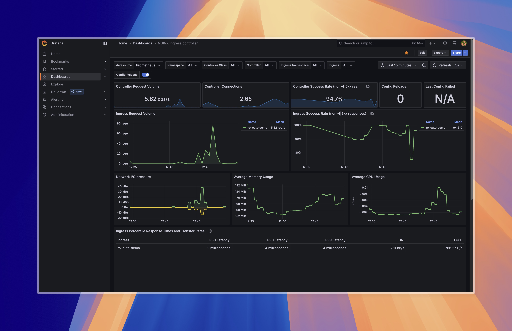
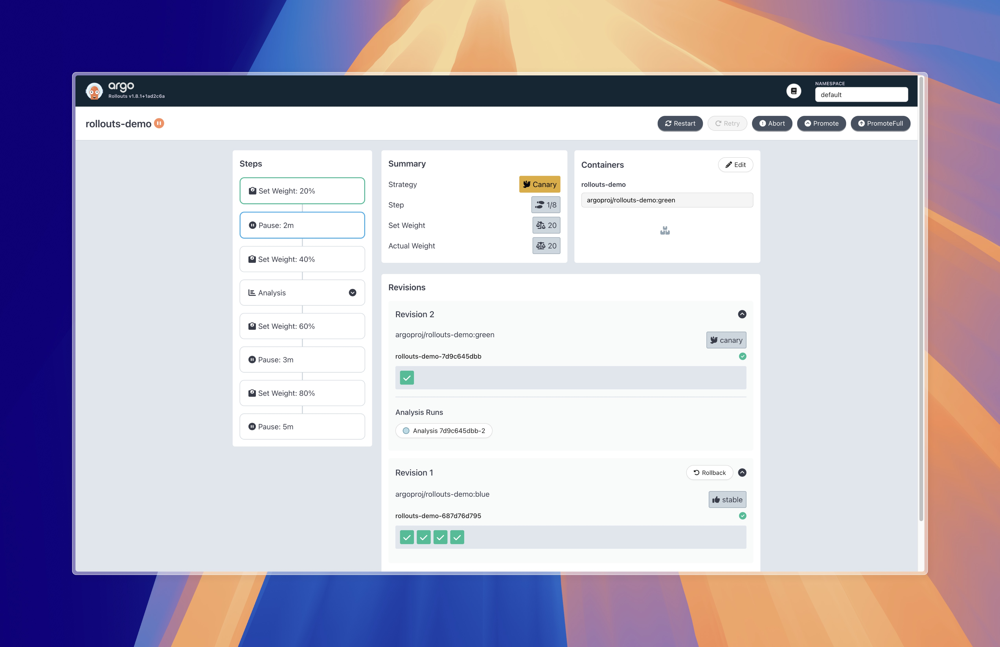

# Argo Rollouts Demo

A complete local environment for demonstrating [Argo Rollouts](https://argoproj.github.io/argo-rollouts/) with Nginx Ingress Controller and Prometheus monitoring.





## Overview

This project provides a development environment to showcase progressive delivery capabilities with Argo Rollouts:

- Local Kubernetes environment (kind, minikube, or k3d)
- Nginx Ingress Controller for traffic management
- Prometheus and Grafana for metrics and visualization
- Example applications demonstrating various deployment strategies

## Prerequisites

- Kubernetes cluster (minikube, kind, or k3d)
- kubectl
- Helm
- [Argo Rollouts kubectl plugin](https://argoproj.github.io/argo-rollouts/installation/#kubectl-plugin-installation)

## Setup

### 1. Start Local Kubernetes Cluster

```bash
# Using kind
kind create cluster --name argo-rollouts-demo

# OR with minikube
minikube start --cpus 4 --memory 8192
```

### 2. Install ArgoCD

```bash
kubectl apply -k argocd
```

### 3. Install kube-prometheus-stack, Nginx Ingress Controller and Argo Rollouts using ArgoCD

```bash
kubectl apply -k apps/kube-prometheus-stack
kubectl apply -k apps/nginx-ingress-controller
kubectl apply -k apps/argo-rollouts
```

### 4. Deploy Demo Applications

```bash
kubectl apply -f ./apps/rollouts-demo
```

## Usage

### Accessing Demo Applications

#### Set Up Ingress Host

```bash
export INGRESS_HOST=$(kubectl get svc -n ingress-nginx ingress-nginx-controller -o jsonpath='{.status.loadBalancer.ingress[0].ip}')

# If using minikube, run in a separate terminal:
# minikube tunnel
```

#### Access Example Application

```bash
# Get host and IP
kubectl get ingress rollouts-demo -o jsonpath='{.spec.rules[0].host}'
kubectl get ingress rollouts-demo -o jsonpath='{.status.loadBalancer.ingress[0].ip}'

# Add to /etc/hosts for local testing
# Example: echo '198.19.249.2 rollouts-demo.example.com' >> /etc/hosts

# Then open http://rollouts-demo.example.com in your browser
```

#### Access Argo Rollouts Dashboard

```bash
kubectl argo rollouts dashboard
# Open http://localhost:3100/rollouts
```

#### Access Grafana

```bash
# Port-forward Grafana service
kubectl port-forward svc/prometheus-grafana -n monitoring 3000:80

# Access Grafana at http://localhost:3000
# Default credentials: admin / prom-operator

# Import Nginx dashboard:
# https://raw.githubusercontent.com/kubernetes/ingress-nginx/main/deploy/grafana/dashboards/nginx.json

# Import Argo dashboard by ID: 14584
```

### Managing Rollouts

#### Trigger a Rollout

```bash
# Update application image to trigger rollout
kubectl argo rollouts set image rollouts-demo rollouts-demo=argoproj/rollouts-demo:blue

# Watch rollout progress
kubectl argo rollouts get rollout rollouts-demo --watch
```

#### Promote a Rollout

```bash
# After verification, promote the rollout
kubectl argo rollouts promote rollouts-demo
```

## Deployment Strategies

1. **Canary Deployment**: Gradually shifts traffic from stable to new version
2. **Blue/Green Deployment**: Deploys new version alongside old version, then switches traffic
3. **Analysis with Prometheus**: Uses metrics to automatically validate deployments

## Project Structure

```
.
├── README.md
├── apps/                       # Application manifests
│   ├── argo-rollouts/          # Argo Rollouts components
│   ├── ingress-nginx/          # Ingress controller
│   ├── kube-prometheus-stack/  # Prometheus and Grafana
│   └── rollouts-demo/          # Demo application
└── screenshots/                # Demo screenshots
```

## Troubleshooting

- **Ingress controller not responding**: Check if ingress controller is running with `kubectl get pods -n ingress-nginx`
- **Metrics not showing in Prometheus**: Verify ServiceMonitor resources are correctly configured

## Resources

- [Argo Rollouts Documentation](https://argoproj.github.io/argo-rollouts/)
- [Nginx Ingress Controller](https://kubernetes.github.io/ingress-nginx/)
- [Prometheus Documentation](https://prometheus.io/docs/introduction/overview/)
